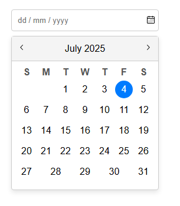

# 📅 Datepicker-UI Component

A lightweight, customizable, and accessible **Datepicker Component**, built using **HTML, CSS, and JavaScript**.  
Supports dynamic month rendering, date selection, and modern UX features.

---

## ✨ Features

- ✅ Toggle calendar visibility when clicking the calendar icon.
- ✅ Display the correct **month and year dynamically**.
- ✅ Navigate between months using **Next/Previous buttons**.
- ✅ Populate the days dynamically based on the selected month.
- ✅ Update the input field when a date is selected.

---

## 🚀 Enhancements

- ✅ **Highlight today’s date** for better context.
- ✅ Support **custom date format**: `dd / mm / yyyy`.
- ✅ Add **keyboard accessibility**:
  - Navigate with arrow keys.
  - Select dates with `Enter`.
  - Close calendar with `Esc`.
- ✅ Restrict selectable dates using **min/max date limits** (e.g., 2020–2030).

---

## 📷 Datepicker Screenshot

_*)*_

---
